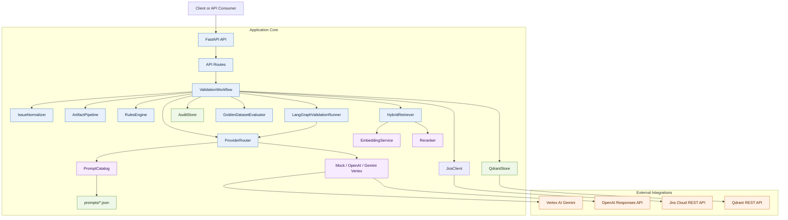
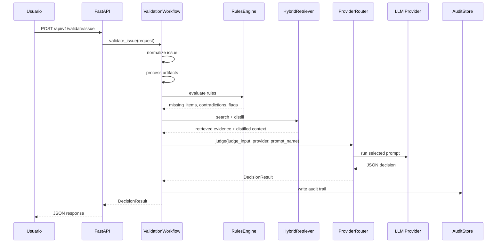
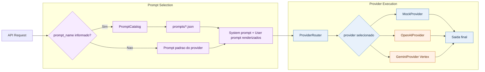
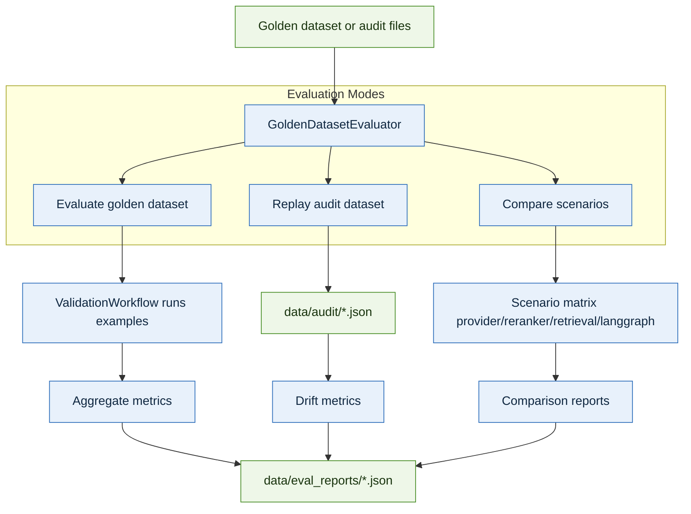
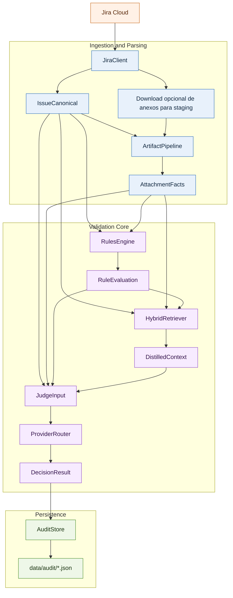

# Application Architecture

Este documento descreve a arquitetura da aplicacao de validacao de issues com RAG, prompts selecionaveis e providers externos controlados por politica de confidencialidade.

## Objetivo

A aplicacao recebe uma issue, opcionalmente processa evidencias locais ou anexos vindos do Jira, aplica regras deterministicas, recupera contexto relevante, executa julgamento por provider configurado e retorna uma decisao auditavel.

## Visao Geral



## Fluxo Principal de Validacao



## Fluxo de Prompts e Providers



## Componentes

### 1. API Layer

- Arquivo principal: `src/jira_issue_rag/api/routes.py`
- Responsavel por expor endpoints de validacao, Jira, indexacao, prompts e avaliacao.
- A API delega toda a orquestracao para `ValidationWorkflow`.

### 2. Workflow Layer

- Arquivo principal: `src/jira_issue_rag/services/workflow.py`
- Centraliza o fluxo de validacao.
- Decide entre execucao direta ou execucao via LangGraph.
- Reune artefatos, regras, retrieval, prompts, provider e auditoria.

### 3. Prompt Layer

- Catalogo: `src/jira_issue_rag/services/prompt_catalog.py`
- Pasta de prompts: `prompts/`
- Cada prompt e um arquivo JSON com:
  - `name`
  - `mode`
  - `description`
  - `system_prompt`
  - `user_prompt_template`
- Hoje existem dois prompts iniciais:
  - `triage_test`
  - `article_analysis`

### 4. Evidence Processing Layer

- `ArtifactPipeline` processa logs, textos, PDFs, planilhas e imagens com sidecar textual.
- O resultado vira `AttachmentFacts`, usado nas regras e no retrieval.

### 5. Rules Layer

- `RulesEngine` executa checagens deterministicas.
- Detecta faltas de informacao, contradicoes e sinais de impacto financeiro.
- Essas regras continuam sendo a primeira linha de controle, mesmo com LLM.

### 6. Retrieval Layer

- `HybridRetriever` mistura contexto local, snippets de politica e opcionalmente Qdrant.
- `EmbeddingService` gera embeddings locais ou externos, conforme politica.
- `Reranker` melhora a ordem final dos candidatos quando habilitado.

### 7. Provider Layer

- `ProviderRouter` seleciona o provider final.
- Providers suportados:
  - `mock`
  - `openai`
  - `gemini` via Vertex AI
- Quando um `prompt_name` e enviado, o provider usa o prompt selecionado em vez do prompt padrao hardcoded.

### 8. Audit Layer

- `AuditStore` grava o pacote de execucao em `data/audit`.
- O audit inclui issue normalizada, facts, regras, retrieval, contexto destilado e decisao final.

### 9. Evaluation Layer

- `GoldenDatasetEvaluator` suporta:
  - avaliacao em dataset rotulado
  - replay de auditoria
  - comparacao de cenarios
- Relatorios agregados sao gravados em `data/eval_reports`.

## Politica de Confidencialidade

A aplicacao opera com modo confidencial por padrao.

### Regras de egress

- `CONFIDENTIALITY_MODE=true` por default
- envio para terceiros so ocorre com opt-in explicito
- controles:
  - `ALLOW_THIRD_PARTY_LLM`
  - `ALLOW_THIRD_PARTY_EMBEDDINGS`
  - `ALLOW_EXTERNAL_VECTOR_STORE`

### Efeito pratico

- sem opt-in, providers externos nao sao usados
- embeddings externos nao sao usados
- Qdrant externo nao e usado
- o sistema cai para comportamento local ou `mock`

## Integrações Externas

## Fluxo de Avaliacao e Comparacao



## Fluxo Jira ate Auditoria



### Jira Cloud

- Fonte opcional para buscar issue, comentarios, changelog e anexos.
- Implementado em `src/jira_issue_rag/services/jira.py`.

### Vertex AI Gemini

- Implementado em `src/jira_issue_rag/providers/gemini_provider.py`.
- Autenticacao via service account JSON configurado por `GOOGLE_APPLICATION_CREDENTIALS`.

### OpenAI

- Implementado em `src/jira_issue_rag/providers/openai_provider.py`.

### Qdrant

- Implementado em `src/jira_issue_rag/services/qdrant_store.py`.

## Estrutura de Pastas

```text
rag/
|-- prompts/
|   |-- triage_test.json
|   `-- article_analysis.json
|-- src/jira_issue_rag/
|   |-- api/
|   |-- core/
|   |-- providers/
|   |-- services/
|   `-- shared/
|-- examples/
|-- data/
|   |-- audit/
|   |-- eval_reports/
|   `-- staging/
|-- tests/
|-- README.md
`-- README_architecture.md
```

## Endpoints Principais

- `POST /api/v1/validate/issue`
- `POST /api/v1/validate/folder`
- `POST /api/v1/jira/validate/{issue_key}`
- `GET /api/v1/prompts`
- `POST /api/v1/prompts/execute`
- `POST /api/v1/evaluate/golden`
- `POST /api/v1/evaluate/compare`
- `POST /api/v1/evaluate/replay`

## Decisoes de Projeto

### Por que separar prompts em arquivos?

- facilita evolucao sem mexer no provider
- permite selecionar prompt por endpoint ou request
- prepara o terreno para um laboratorio offline de tuning com DSPy/GEPA no futuro

### Por que manter regras deterministicas junto com LLM?

- melhora previsibilidade
- reduz dependencia de inferencia para checagens simples
- fornece base auditavel para casos sensiveis

### Por que usar workflow central?

- concentra a orquestracao em um unico ponto
- reduz acoplamento entre API e providers
- facilita replay, avaliacao e comparacao de cenarios

## Evolucao Natural

- adicionar mais prompts por dominio
- criar versionamento de prompts por ambiente
- plugar laboratorio offline de optimizacao com DSPy/GEPA
- adicionar UI de revisao humana
- reforcar redaction em trilhas de auditoria
