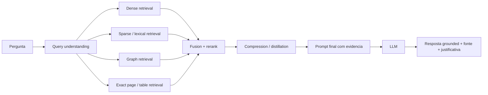

# RAG Ainda e Necessario?

## 1. Objetivo

Este documento organiza uma apresentacao tecnica para responder uma pergunta que hoje aparece com frequencia em times de engenharia:

> Se ja temos busca semantica, hybrid retrieval, knowledge graph e GraphRAG, o RAG ainda e necessario?

O objetivo deste material nao e defender `RAG` como buzzword. O objetivo e separar claramente:

- o que e **retrieval**
- o que e **busca semantica**
- o que e **grafo / knowledge graph**
- o que e **RAG como arquitetura de grounding**
- e em que ponto um sistema deixa de ser so retrieval e passa a ser **retrieval + generation + decisao com evidencia**

Este README complementa o material de [README_from_tokens_to_rag.md](README_from_tokens_to_rag.md), mas com foco muito maior em:

- `quando usar RAG`
- `quando nao usar RAG`
- `quando busca semantica basta`
- `quando grafo agrega mais do que vetor puro`
- `quando semantic search + graph retrieval continuam precisando de uma camada de RAG`

### Material complementar

- Deck em Markdown: [APRESENTACAO_RAG_AINDA_E_NECESSARIO.md](APRESENTACAO_RAG_AINDA_E_NECESSARIO.md)
- Guia de fala detalhado: [GUIA_DE_FALA_RAG_AINDA_E_NECESSARIO.md](GUIA_DE_FALA_RAG_AINDA_E_NECESSARIO.md)

---

## 2. Resposta curta

### Sim, RAG ainda e necessario.

Mas com uma qualificacao importante:

- o que ficou fraco foi o **RAG simplista**: `embedding -> top-k -> prompt -> resposta`
- o que continua forte e necessario e o **RAG como arquitetura de grounding**
- em 2026, isso normalmente significa combinar:
  - busca semantica
  - busca lexical / sparse
  - filtros por metadado
  - reranking
  - exact retrieval para pagina, tabela ou trecho literal
  - knowledge graph / multi-hop retrieval quando a pergunta exige relacoes
  - compressao / distillation de contexto
  - avaliacao e trilha de evidencia

Em outras palavras:

> Busca semantica e grafos nao matam o RAG. Eles tornam a camada de retrieval do RAG mais madura.

---

## 3. O que o acervo local realmente mostra

Antes de sustentar a tese desta apresentacao, foi feita uma triagem ampla do acervo local que hoje alimenta o repo:

- `1308` PDFs em `scripts/article_scraper/results/downloads`
- `1078` arquivos de metadata em `scripts/article_scraper/results/metadata`
- `677` registros com sinais amplos de RAG, graph retrieval, hybrid retrieval ou evaluation
- quando a busca e literal nos termos mais recentes, o corpus indexado mostra uma distribuicao mais restrita:
  - `context engineering = 0`
  - `semantic layer = 0`
  - `GraphRAG = 1`
  - `hybrid retrieval = 4`
  - `agentic RAG = 6`
  - `evaluation = 26`

Isso importa para manter o material tecnicamente honesto:

- o acervo local e forte para `RAG moderno`, `hybrid retrieval`, `evaluation`, `trust` e `graph-assisted retrieval`
- o acervo local e mais fraco, em termos de vocabulario explicito, para `context engineering` e `semantic layers`
- por isso a apresentacao precisa separar o que vem do **miolo tecnico do acervo local** e o que vem da **moldura conceitual mais recente** dos dois textos externos selecionados

### 3.1 Sete papers do acervo local que sustentam a tese

1. **Retrieval-Augmented Generation for Large Language Models: A Survey (2023)**
   - O PDF confirma a taxonomia `naive RAG`, `advanced RAG` e `modular RAG`.
   - O paper tambem organiza RAG nas tres camadas `retrieval`, `generation` e `augmentation`.
   - Isso sustenta a ideia de que RAG nao e um unico truque, e sim uma familia de arquiteturas.

2. **Blended RAG: Improving RAG Accuracy with Semantic Search and Hybrid Query-Based Retrievers (2024)**
   - A conclusao do paper e direta: a qualidade do retriever domina a qualidade do pipeline.
   - O trabalho mostra que dense + sparse + query blending levou o retriever a `87%` de accuracy em `TREC-COVID` e elevou o RAG acima de baselines fortes, inclusive acima de fine-tuning em certos cenarios de Q&A.
   - Isso sustenta a tese de que o ganho moderno nao vem de mais prompt, mas de retrieval melhor desenhado.

3. **Engineering the RAG Stack: A Comprehensive Review of the Architecture and Trust Frameworks for RAG Systems (2025)**
   - O paper reforca que o ecossistema de RAG ficou fragmentado em tecnicas, fusion mechanisms, retrieval strategies e orchestration approaches.
   - A contribuicao forte e consolidar uma taxonomia unificada e trazer `quantitative assessment`, `trust`, `alignment`, `security` e `domain adaptability` para o centro da conversa.
   - Isso sustenta a parte enterprise da apresentacao: RAG maduro e tambem governanca, confianca e operacao.

4. **A Systematic Review of Key RAG Systems: Progress, Gaps, and Future Directions (2025)**
   - O paper mostra que a evolucao recente de RAG ja esta sendo lida como um deslocamento para `hybrid retrieval`, `privacy-preserving techniques`, `optimized fusion strategies` e `agentic RAG`.
   - Ele tambem traz explicitamente o lado enterprise: `retrieval accuracy`, `generation fluency`, `latency`, `computational efficiency`, `security` e `integration overhead`.
   - Isso ajuda a demonstrar que a pergunta correta nao e `RAG ou nao RAG`, mas `qual stack de retrieval e generation fecha este problema com risco e custo aceitaveis`.

5. **BYOKG-RAG: Multi-Strategy Graph Retrieval for Knowledge Graph Question Answering (2025)**
   - O paper mostra que grafo sozinho nao e so traversal cega, e retrieval com varias estrategias.
   - BYOKG-RAG combina LLMs com graph tools para gerar entidades, respostas candidatas, reasoning paths e queries OpenCypher, e depois refina isso iterativamente com contexto recuperado.
   - O resultado reportado e `+4.5` pontos sobre o segundo melhor metodo de graph retrieval, com melhor generalizacao para `bring-your-own KGs`.

6. **TigerVector: Supporting Vector Search in Graph Databases for Advanced RAGs (2025)**
   - O paper desloca a discussao do algoritmo para a infraestrutura: graph query e vector search podem viver no mesmo substrate.
   - TigerVector estende o TigerGraph para suportar vector search e composicao entre busca vetorial e consultas em grafo no mesmo mecanismo.
   - Isso sustenta a mensagem de arquitetura: GraphRAG maduro nao e apenas um truque de prompt, mas tambem uma decisao de storage, query model e infraestrutura.

7. **FAIR-RAG: Faithful Adaptive Iterative Refinement for Retrieval-Augmented Generation (2025)**
   - O paper reforca que multi-hop e perguntas complexas nao fecham em `single-pass retrieval`.
   - A contribuicao central e o modulo `Structured Evidence Assessment (SEA)`, que decompoe a pergunta, identifica lacunas de evidencia e gera novas queries para fechar essas lacunas.
   - O trabalho reporta `F1 = 0.453` no HotpotQA, com ganho absoluto de `8.3` pontos sobre o baseline iterativo mais forte.

### 3.2 O que esses sete papers convergem

Tomados em conjunto, os sete papers empurram a apresentacao para cinco conclusoes mais fortes:

1. **O que morreu foi o naive RAG**
   - top-k vetorial fixo com prompt final simples nao fecha bem colecoes grandes, perguntas multi-hop ou cenarios enterprise

2. **Retriever continua decidindo mais do que gerador**
   - Blended RAG, TigerVector e FAIR-RAG convergem nisso por caminhos diferentes

3. **Graph retrieval agrega quando a pergunta pede relacao explicita**
   - BYOKG-RAG e TigerVector mostram que relacao, caminho e composicao de consulta importam muito quando similaridade textual sozinha nao basta

4. **RAG moderno e tambem infraestrutura, avaliacao e trust**
   - Engineering the RAG Stack e a Systematic Review de 2025 deixam claro que deploy serio exige governance, metrics, privacy e cost awareness

5. **Perguntas complexas pedem iteracao e controle de evidencia**
   - FAIR-RAG torna isso explicito: sem medir lacunas de evidencia, o sistema propaga ruido com aparencia de fundamentacao

### 3.3 Onde o acervo ainda tem lacuna real

O acervo local sustenta muito bem `hybrid retrieval`, `evaluation`, `faithfulness`, `graph-assisted retrieval` e `advanced RAG`.

Mas ele ainda nao sustenta com a mesma densidade, em termos de termos explicitos no metadata indexado, a moldura de:

- `context engineering`
- `semantic layers`
- `metadata-aware context governance`

Isso nao invalida a tese. So muda a forma correta de apresenta-la:

- o **miolo tecnico** vem do acervo local
- a **moldura conceitual mais recente** vem dos dois textos externos selecionados

### 3.4 Leitura cruzada dos dois artigos recentes

Esta apresentacao ficou mais precisa depois da leitura em conjunto de dois textos recentes:

- **Is RAG Dead? The Rise of Context Engineering and Semantic Layers for Agentic AI**
- **Context Engineering**

Eles nao dizem exatamente a mesma coisa, mas ajudam a completar a parte do discurso que o acervo local ainda cobre menos por vocabulario explicito.

**O que o primeiro artigo adiciona**

- `semantic layer`
- `knowledge graph`
- `metadata management`
- `policy-aware retrieval`
- `provenance`, `coverage`, `recency` e `explainability`

Ele ajuda a dizer de forma mais clara que o debate enterprise nao e sobre abandonar retrieval com grounding, e sim sobre deixar para tras a versao simplista de retrieval vetorial sem governanca.

**O que o segundo artigo adiciona**

- `write`, `select`, `compress`, `isolate`
- agentes que acumulam contexto demais
- falhas como `context poisoning`, `context distraction`, `context confusion` e `context clash`
- state, checkpoints, memory e controle por etapa

Ele desloca o debate de `como recuperar documentos` para `como injetar o contexto certo, na quantidade certa, na hora certa, em cada passo do agente`.

### 3.5 Tese final depois da leitura cruzada

> RAG ainda e necessario quando o sistema precisa transformar evidencias em resposta final confiavel. O que mudou foi a definicao de "bom RAG": agora ele e hibrido, relacional, comprimido, observavel, governado e, em cenarios mais dificeis, iterativo.

Existe uma implementacao local dessa comparacao em [examples/rag_types_demo/README.md](../examples/rag_types_demo/README.md).

---

## 4. A pergunta certa

Em vez de perguntar apenas:

> `RAG ainda e necessario?`

A pergunta mais tecnica e mais util para a equipe e:

> `Quando retrieval puro basta, e quando o sistema ainda precisa de uma camada de geracao condicionada por evidencia?`

Se o usuario final vai:

- abrir os documentos por conta propria
- ler os resultados recuperados manualmente
- fazer a interpretacao sozinho

entao um sistema de retrieval pode bastar.

Mas se o sistema precisa:

- **sintetizar** evidencias de multiplas fontes
- **responder em linguagem natural**
- **explicar** por que chegou a uma conclusao
- **comparar** documentos, issues, politicas e runbooks
- **citar** ou apontar evidencias
- **transformar retrieval em decisao operacional**

entao ainda existe um espaco claro para RAG.

---

## 5. O que nao deve ser confundido

| Conceito | O que faz | O que nao faz sozinho |
|---|---|---|
| **Busca lexical** | acha correspondencia literal de termos, IDs, codigos, nomes e trechos exatos | nao entende bem similaridade semantica |
| **Busca semantica** | acha textos semanticamente parecidos usando embeddings | nao entende explicitamente relacoes estruturadas nem garante trecho exato |
| **Graph retrieval** | segue entidades e relacoes explicitas no grafo, inclusive multi-hop | nao resolve sozinho texto livre, nuance semantica e sintese final |
| **Hybrid retrieval** | combina dense + sparse + metadados + possivelmente grafo | ainda e retrieval, nao resposta final |
| **RAG** | usa retrieval para montar contexto e depois gera resposta condicionada por evidencia | depende da qualidade do retrieval e nao elimina hallucination por definicao |
| **GraphRAG** | usa grafo como parte da recuperacao e da expansao de contexto relacional | nao substitui automaticamente reranking, compression, prompt template e avaliacao |

### Tese central desta apresentacao

`semantic search + graphs` e uma **estrategia de retrieval**.

`RAG` e uma **arquitetura de sistema** que pode usar essa estrategia de retrieval como base.

Se o LLM ainda recebe contexto recuperado e gera uma resposta final, voce continua tendo RAG.

---

## 6. Quando busca semantica basta

Ha varios cenarios em que nao faz sentido complicar com RAG logo de inicio.

### Casos onde semantic search pode bastar

1. **Descoberta de documentos parecidos**
   - encontrar tickets semelhantes
   - recuperar artigos tecnicos proximos
   - localizar incidentes similares

2. **Exploracao assistida por humano**
   - analista abre os top resultados e decide
   - equipe de suporte quer achar material relevante, mas nao precisa de sintese automatica

3. **Clustering e navegacao de corpus**
   - agrupar documentos por tema
   - descobrir familias de problemas
   - explorar neighborhoods semanticos

4. **Busca sem exigencia de resposta final sintetizada**
   - o sistema nao precisa dar a resposta; so precisa levar o humano ao material certo

### Limite da busca semantica

Busca semantica tende a ir muito bem em perguntas como:

- `quais documentos falam sobre cache invalidation?`
- `encontre incidentes parecidos com este erro`
- `quais artigos tratam de evaluation em RAG?`

Mas ela tende a ser insuficiente quando a pergunta muda para:

- `qual foi a sequencia causal entre A, B e C?`
- `qual componente provavelmente causou o efeito no servico X?`
- `o que mudou entre a politica antiga e a nova?`
- `qual resposta consolidada devo dar ao time com base nesses cinco documentos?`

---

## 7. Quando grafos agregam mais do que vetor puro

Grafos entram com forca quando o problema deixa de ser apenas `similaridade textual` e passa a exigir `relacao explicita entre entidades`.

### Casos tipicos onde grafos agregam muito

1. **Multi-hop reasoning**
   - issue A bloqueia issue B
   - B esta ligada ao componente C
   - C usa o servico D
   - D esta associado a um fingerprint de erro recorrente

2. **Analise de impacto**
   - o que mais esta ligado a este componente?
   - que servicos e ambientes aparecem conectados a essa falha?

3. **Root-cause chains**
   - reconstruir uma cadeia de causalidade entre incidentes, dependencias e mudancas

4. **Desambiguacao por entidade**
   - diferenciar projetos, clientes, ambientes, modulos e erros com nomes parecidos

5. **Timeline e relacoes cruzadas**
   - consultas que pedem ponte entre multiplos documentos, issues ou eventos

### O que o repo ja assume nesse ponto

No estado atual do projeto, o retrieval ja nao e tratado como `vector search simples`. O repo explicita modos como:

- `vector-global`
- `graph-local`
- `graph-bridge`
- `graph-multi-hop`
- `exact-page`
- `corrective`

Isso e um sinal claro de maturidade arquitetural: o time ja reconhece que perguntas diferentes exigem **estrategias de retrieval diferentes**.

---

## 8. Onde RAG continua sendo necessario

Mesmo com busca semantica forte e grafo bem montado, RAG continua necessario quando o sistema precisa ir alem de `encontrar` e passar a `responder com base no que encontrou`.

### RAG continua necessario quando voce precisa:

1. **Sintese multi-documento**
   - consolidar runbook, ticket, changelog, FAQ e politica interna em uma unica resposta

2. **Resposta natural para usuario final**
   - transformar evidencias em texto claro, estruturado e acionavel

3. **Justificativa com grounding**
   - explicar a resposta e apontar evidencias proximas da fonte

4. **Transformacao de retrieval em decisao**
   - `isso parece bug real ou falso positivo?`
   - `essa issue esta pronta para desenvolvimento?`
   - `essa resposta precisa de escalonamento?`

5. **Normalizacao da saida**
   - JSON estruturado
   - resumo executivo
   - checklist de acao
   - risco / confianca / proximos passos

6. **Reducao de carga cognitiva**
   - o sistema precisa entregar uma resposta utilizavel sem obrigar o humano a ler 20 chunks crus

### Frase importante para a apresentacao

> Busca semantica encontra o que parece parecido. Grafo encontra o que esta ligado. RAG transforma isso em resposta utilizavel.

---

## 9. O que morreu foi o RAG naive

Vale ser bem direto com a equipe.

### O que ficou fraco

- um unico retriever vetorial
- top-k fixo sem reranking
- sem filtros por metadado
- sem exact retrieval
- sem grafo
- sem avaliacao
- sem controle de faithfulness

### O que continua forte

- hybrid retrieval
- graph-assisted retrieval
- reranking
- contextual compression
- corrective retrieval
- evidence-first generation
- metrics + audit trail

Em 2026, a discussao nao deveria ser `RAG vs nao RAG` de forma simplista.

A discussao correta deveria ser:

> `Que camada de retrieval e que camada de generation eu preciso para este tipo de pergunta, dado, risco e custo?`

---

## 10. Modelos de arquitetura para comparar na apresentacao

### Modelo 1 - Semantic Search only

**Pipeline:**

`query -> embeddings -> vector search -> lista de resultados`

**Bom para:**

- descoberta
- similares
- exploracao de corpus

**Fraco em:**

- multi-hop
- resposta final consolidada
- citacao precisa de trechos complexos

### Modelo 2 - Semantic Search + Metadata Filters

**Pipeline:**

`query -> embeddings -> vector search + filtros -> top-k mais limpo`

**Bom para:**

- contexto corporativo
- queries por projeto, ambiente, data, servico

**Fraco em:**

- relacoes profundas entre entidades
- sintese final

### Modelo 3 - Graph Retrieval only

**Pipeline:**

`query -> entity extraction -> graph traversal -> subgrafo / caminhos`

**Bom para:**

- ligacoes explicitas
- analise de impacto
- root-cause chains
- queries multi-hop

**Fraco em:**

- texto nao estruturado
- nuance semantica de chunks longos
- resposta final de alto nivel

### Modelo 4 - Hybrid Retrieval sem generation

**Pipeline:**

`query -> dense + sparse + graph + exact -> fuse -> rerank -> resultados para humano`

**Bom para:**

- analista tecnico forte
- investigacao manual
- comparacao de modos de retrieval

**Fraco em:**

- resposta final pronta para consumo
- automacao de decisao

### Modelo 5 - Hybrid GraphRAG

**Pipeline:**

`query -> dense + sparse + graph + exact -> rerank -> compress -> prompt -> LLM -> resposta grounded`

**Bom para:**

- assistente tecnico
- explicacao de contexto
- sintese multi-fonte
- decisao com justificativa

**Fraco em:**

- custo maior
- pipeline mais complexo
- exige avaliacao real

### Modelo 6 - Corrective / Agentic GraphRAG

**Pipeline:**

`query -> retrieval inicial -> avaliacao da cobertura -> nova busca / bridge / exact / graph hop -> resposta final`

**Bom para:**

- perguntas ambiguas
- perguntas multi-etapa
- cenarios enterprise com varias fontes e maior risco

**Fraco em:**

- latencia
- custo
- depuracao mais dificil

---

## 11. Tese recomendada para esta apresentacao

Se a equipe precisar de uma tese curta e forte, a recomendacao e esta:

> RAG ainda e necessario, mas nao como slogan e nem como top-k vetorial simplista. O que faz sentido hoje e uma arquitetura de grounding que combine semantic search, retrieval lexical, filtros, grafos, reranking, compression e generation orientada por evidencia.

Outra versao curta:

> O que desaparece nao e o RAG; o que desaparece e a ilusao de que vetor puro resolve tudo.

E uma terceira versao, mais didatica:

> Semantic search responde "o que parece parecido?". Grafo responde "o que esta ligado?". RAG responde "como transformar isso em uma resposta util, explicavel e operacional?".

---

## 12. Arquitetura sugerida para mostrar no slide

### Mensagem do diagrama

O ponto importante aqui e mostrar que:

- semantic search e um **braco de retrieval**
- graph retrieval e outro **braco de retrieval**
- exact retrieval pode ser um terceiro **braco de retrieval**
- RAG e a **arquitetura que pega o melhor desses sinais e transforma em resposta final**

---

## 13. Estrutura sugerida de slides

### Sequencia recomendada para o deck do dashboard

1. **Pergunta de abertura**
   - `RAG ainda e necessario?`
   - mensagem: o que morreu foi o `naive RAG`, nao a arquitetura de grounding

2. **O que o acervo local mostra**
   - mostrar `1308` PDFs, `1078` metadata e o recorte literal de termos recentes
   - mensagem: a base local sustenta hybrid, evaluation e graph-assisted retrieval melhor do que o vocabulario de `context engineering`

3. **A resposta curta**
   - separar `retrieval`, `graph retrieval`, `hybrid retrieval` e `RAG`
   - mensagem: busca semantica e grafo sao estrategias de retrieval; RAG e arquitetura de sistema

4. **Survey base do acervo**
   - usar Gao et al. para explicar `naive`, `advanced` e `modular RAG`
   - mensagem: RAG sempre foi familia de arquiteturas, nao um pipeline unico

5. **Paper de ganho em retrieval**
   - usar Blended RAG
   - mensagem: dense + sparse + query blending melhora retrieval e eleva a qualidade do RAG

6. **Papers de arquitetura e trust**
   - usar Engineering the RAG Stack + A Systematic Review of Key RAG Systems
   - mensagem: em 2025, RAG ja e lido como problema de arquitetura, avaliacao, seguranca, custo e governanca

7. **Paper de graph retrieval**
   - usar BYOKG-RAG
   - mensagem: grafo nao e so traversal; retrieval relacional precisa ser multi-estrategia e robusto a KGs customizados

8. **Paper de infraestrutura**
   - usar TigerVector
   - mensagem: advanced RAG tambem depende de storage e query model que unifiquem grafo e vetor

9. **Paper de corrective / agentic RAG**
   - usar FAIR-RAG
   - mensagem: perguntas multi-hop precisam medir lacunas de evidencia e refazer busca

10. **Os dois textos recentes como moldura conceitual**
   - usar *Is RAG Dead?* e *Context Engineering*
   - mensagem: semantic layers e context engineering expandem o discurso, mas nao substituem o miolo tecnico mostrado pelo acervo local

11. **Comparacao de arquiteturas**
   - semantic only vs graph only vs hybrid retrieval vs hybrid GraphRAG
   - mensagem: a pergunta certa define o grau de retrieval e generation necessario

12. **Demonstracao local**
   - rodar o laboratorio em quatro modos com a mesma pergunta
   - mensagem: semantic search encontra similares; grafo encontra ligacoes; hybrid RAG entrega resposta utilizavel

13. **A arquitetura recomendada**
   - query understanding -> dense/sparse/graph/exact -> fusion + rerank -> compression -> resposta grounded
   - mensagem: RAG moderno e pipeline de retrieval governado, nao top-k vetorial sozinho

14. **Fechamento**
   - tese final: RAG ainda e necessario quando o objetivo nao e apenas recuperar informacao, mas transformar evidencias em resposta confiavel, explicavel e acionavel

---

## 14. Projeto de demonstracao sugerido

Se a apresentacao for acompanhada de demo, a demonstracao fica muito melhor se usar o **mesmo conjunto de perguntas** em modos diferentes.

### Corpus sugerido

- issues ligadas entre si
- runbooks
- changelogs
- documentos de arquitetura
- artigos tecnicos
- PDFs com tabelas e seccoes

### Quatro perguntas boas para demo

1. **Pergunta de similaridade**
   - `quais incidentes sao semanticamente parecidos com este erro?`
   - expectativa: busca semantica vai bem

2. **Pergunta relacional**
   - `que cadeia conecta esta issue ao servico impactado e ao componente suspeito?`
   - expectativa: grafo vai melhor

3. **Pergunta de sintese operacional**
   - `qual resposta devo dar ao time de suporte com base nessas evidencias?`
   - expectativa: retrieval puro nao fecha; RAG agrega muito

4. **Pergunta exata de documento**
   - `em que pagina esta a tabela com a politica X?`
   - expectativa: exact-page retrieval ganha do vetor puro

### Resultado didatico esperado

O time percebe que:

- vetor puro nao resolve tudo
- grafo nao resolve tudo
- retrieval puro sem generation entrega materia-prima, nao resposta final
- o melhor sistema costuma ser **hibrido e orientado ao tipo de pergunta**

### Sinais que a demo local ja mostrou

- No cenario `support`, `graph_only` nao trouxe evidencia operacional suficiente, enquanto `hybrid_graphrag` conseguiu montar uma resposta grounded e acionavel.
- No cenario `chain`, `graph_only` e `hybrid_graphrag` recuperaram a cadeia relacional com mais precisao, enquanto `semantic_only` trouxe ruido desnecessario.
- Isso conversa diretamente com BYOKG-RAG, TigerVector e FAIR-RAG: a pergunta certa decide o tipo de retrieval e se sera preciso iterar para fechar lacunas de evidencia.

### Implementacao local de exemplo

Para transformar essa comparacao em algo executavel dentro do repo, foi criado um mini laboratorio em [examples/rag_types_demo/README.md](../examples/rag_types_demo/README.md).

Ele roda um corpus pequeno, mas didatico, comparando as mesmas perguntas em quatro modos:

- `semantic_only`
- `graph_only`
- `hybrid_retrieval`
- `hybrid_graphrag`

O objetivo nao e competir com o runtime principal do projeto. O objetivo e dar ao time uma demonstracao curta, repetivel e facil de entender.

---

## 15. Frases prontas para a fala

### Frase 1

> O debate nao e mais "RAG ou nao RAG". O debate certo e: que retrieval eu preciso e quanto de generation eu quero colocar em cima dele.

### Frase 2

> Se o humano vai interpretar os resultados crus, retrieval pode bastar. Se o sistema precisa sintetizar e justificar, RAG continua necessario.

### Frase 3

> GraphRAG nao mata o RAG; ele mata o RAG simplista.

### Frase 4

> O problema moderno nao e escolher entre vetor e grafo. O problema moderno e orquestrar vetor, grafo, exact retrieval e generation com grounding.

### Frase 5

> Quanto mais a pergunta exige relacao, causalidade e sintese, mais o desenho de retrieval importa e mais justificativa existe para uma camada de RAG madura.

---

## 16. Fechamento em uma frase

> RAG ainda e necessario quando a necessidade real nao e apenas recuperar informacao, mas transformar evidencias recuperadas por semantic search, lexical search e graph retrieval em uma resposta final confiavel, explicavel e acionavel.

---

## 17. Bibliografia priorizada para sustentar esta tese

### Nucleo do acervo local

- [Retrieval-Augmented Generation for Large Language Models: A Survey](../scripts/article_scraper/results/metadata/hash_6da4a4bdd193.json) — base para explicar `naive`, `advanced` e `modular RAG`.
- [Blended RAG: Improving RAG Accuracy with Semantic Search and Hybrid Query-Based Retrievers](../scripts/article_scraper/results/metadata/10.1109_MIPR62202.2024.00031.json) — base para defender hybrid retrieval como ganho estrutural, nao cosmetico.
- [Engineering the RAG Stack: A Comprehensive Review of the Architecture and Trust Frameworks for Retrieval-Augmented Generation Systems](../scripts/article_scraper/results/metadata/hash_95d62dad6afc.json) — base para arquitetura, trust, governanca e deployment serio.
- [A Systematic Review of Key Retrieval-Augmented Generation (RAG) Systems: Progress, Gaps, and Future Directions](../scripts/article_scraper/results/metadata/10.48550_arXiv.2507.18910.json) — base para gaps, future directions, enterprise concerns e agentic RAG.
- [BYOKG-RAG: Multi-Strategy Graph Retrieval for Knowledge Graph Question Answering](../scripts/article_scraper/results/metadata/10.48550_arXiv.2507.04127.json) — base para graph retrieval multi-estrategia em KGs customizados.
- [TigerVector: Supporting Vector Search in Graph Databases for Advanced RAGs](../scripts/article_scraper/results/metadata/10.1145_3722212.3724456.json) — base para a parte de infraestrutura que unifica grafo e vetor.
- [FAIR-RAG: Faithful Adaptive Iterative Refinement for Retrieval-Augmented Generation](../scripts/article_scraper/results/metadata/hash_044972aa8c0c.json) — base para corrective / agentic retrieval orientado por lacunas de evidencia.

### Complementos recentes para a moldura conceitual

- **Is RAG Dead? The Rise of Context Engineering and Semantic Layers for Agentic AI** — importante para semantic layers, metadata-aware retrieval, provenance e governanca enterprise.
- **Context Engineering** — importante para organizar a parte agentica em `write`, `select`, `compress` e `isolate`.

### Regra editorial para esta apresentacao

Para este tema, a prioridade correta fica assim:

1. papers do acervo local que tragam `survey`, `systematic review`, `benchmark`, `hybrid retrieval`, `graph retrieval`, `evaluation` e `trust`
2. textos recentes externos apenas para fechar a moldura de `context engineering` e `semantic layers`
3. papers fundacionais so para sustentar a base conceitual quando necessario

O risco principal aqui e apresentar `RAG` como moda antiga ou `GraphRAG` como substituto automatico. A leitura mais correta depois da varredura do acervo e:

> GraphRAG, hybrid retrieval, compression, reranking e evaluation sao sinais de maturidade da camada de retrieval dentro de arquiteturas modernas de grounding.